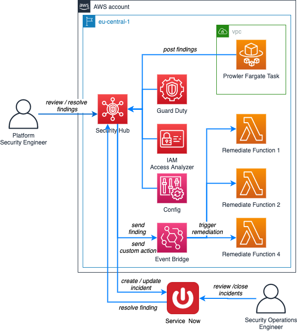
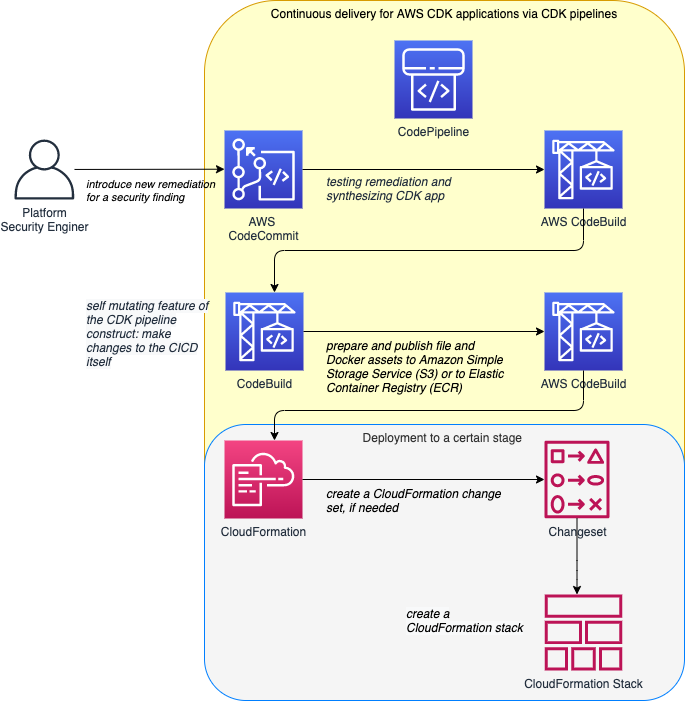
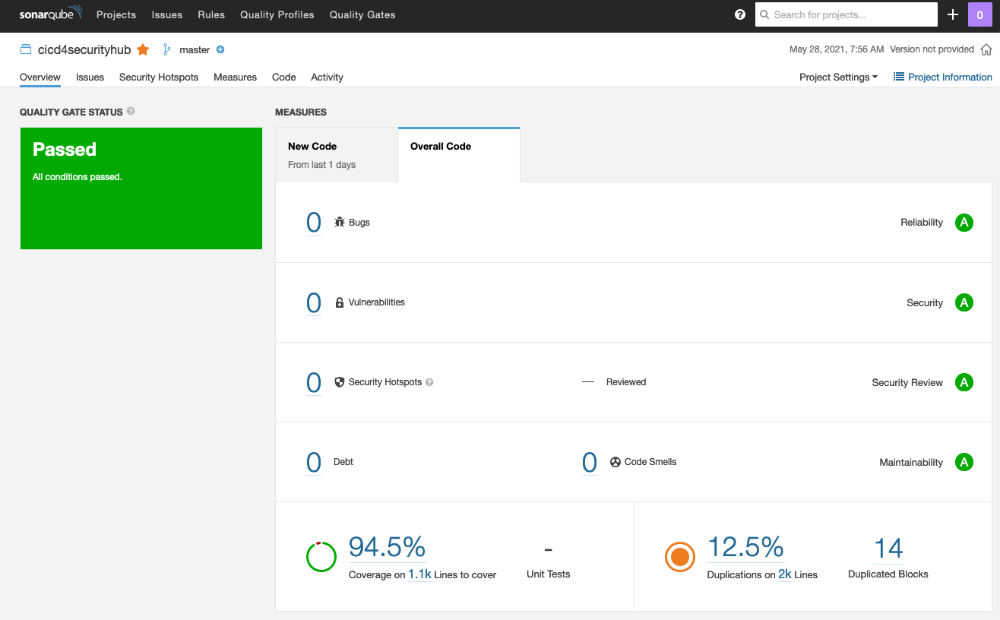

# Automated Security and Compliance Remediation at HDI

This is the corresponding repository of AWS Blog post "Automated Security and Compliance Remediation at HDI".

## Disclaimer

This repository act as a blueprint. HDI will maintain the solution.

## Architecturual Diagrams

This is architecture which will be deployed via all clases residing within `securityhub/auto_ops.py` file.



This is the architecture of the deplyoed CICD pipeline. Stages can be added as needed. A general description about the CDK pipelines comstruct can be found [here](https://aws.amazon.com/de/blogs/developer/cdk-pipelines-continuous-delivery-for-aws-cdk-applications/). The programrrtic implementation can be found here `securityhub/pipeline.py`



The CDK app will deploy all remediation as well as the Prowler integration as [CloudFormation nested stack](https://docs.aws.amazon.com/AWSCloudFormation/latest/UserGuide/using-cfn-nested-stacks.html). This brings the advantage of holding a consistent state of all CDK app parts. Also, it will be easy to work with [CloudFormation imports](https://docs.aws.amazon.com/AWSCloudFormation/latest/UserGuide/resource-import.html) and [exports](https://docs.aws.amazon.com/AWSCloudFormation/latest/UserGuide/using-cfn-stack-exports.html) to make use of resources across CloudFormation stacks.

## Programmatic Approach of this CDK App

Realy make use of the the programmatic capabillities of the CDK, we use functions from `securityhub/helper.py` to avoid iterative declaration of AWS resources. The `create_remediation_lambdas` function from this file, will be used within `securityhub/auto_ops.py` of the `class RemediationStack` to process arrays with Lambda configurations objects within `class AutoSecOps`.

```Python

# Snippet

prowler_740_lambda = {
    "name": "Prowler 7.40",
    "id": "prowler740",
    "description": "Remediates Prowler 7.40 by deleting unencrypted Snapshots",
    "policies": [
        _iam.PolicyStatement(
            effect=_iam.Effect.ALLOW,
            actions=["ec2:DeleteSnapshot",],
            resources=["*"],
        )
    ],
    "path": "delete_unencrypted_snapshots",
    "environment_variables": [
        {"key": "ACCOUNT_ID", "value": core.Aws.ACCOUNT_ID}
    ],
    "filter_id": ["prowler-extra740"],
}

prowler_list = [
    prowler_729_lambda,
    prowler_740_lambda,
]

# ...

print("Lambdas in Prowler Stack", len(cis_list))
prowler_1 = RemediationStack(
    self, id="prowler-remediation}", remediation_list=prowler_list,
)
prowler_1.add_dependency(cis_1)
core.Tags.of(prowler_1).add("Name", "Security Hub App")

```

## How to deploy this CDK App?

* [Install the CDK](https://docs.aws.amazon.com/cdk/latest/guide/getting_started.html#getting_started_install) and [bootstrap your AWS account](https://docs.aws.amazon.com/cdk/latest/guide/getting_started.html#getting_started_bootstrap)
* Clone this repository
* [Create and activate the Python environment](https://python.land/virtual-environments/virtualenv)
* Install all required packages by `pip install -r requirements.txt`
* Change Account IDs

```python
# app.py
# TODO: Insert your AWS account id
cicd = Pipeline(
    app,
    id="cicd-4-securityhub",
    env= core.Environment(account="12345678910", region="eu-central-1"),
)
```

```python
# auto_ops.py
# TODO: Insert your AWS account id
stage = DevSecurityOpsStage(
    self,
    id="sec-ops-utilities",
    env=core.Environment(account="12345678910", region="eu-central-1"),
)
```

* Run `cdk deploy cicd-4-securityhub` to create the CICD.
* Change the origin of this Git repository to CodeCommitand push your file to [CodeCommit](https://docs.aws.amazon.com/codecommit/latest/userguide/how-to-migrate-repository-existing.html#how-to-migrate-existing-clone).

## SonarQube Results

